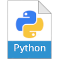
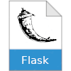
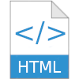
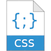
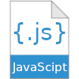
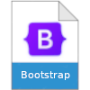

# Hi,

### It's resole79 here

I have had a dream since 8 years old: to become a **developer**.  
My first program was with the commodore 64 at 9 years old.  
After primary school, in Italy, I attended an IT school and that experience gave me the first skills and knowledge to become a web developer.  
I have been working as **web developer** for ten years.  
I came to the UK in 2014 and worked in hospitality. 

I studied Python at [HyperionDev's](https://www.hyperiondev.com/) Software Engineering Bootcamp.       
(I have "Skill Bootcamp in **Software Engineering** certificate")           

# Technical Skills

         

I’m currently learning **Python**, **Flask**, **JavaScript**

# JavaScript Projects

- [The Dicee Game](https://github.com/resole79/the-dicee-game) The **Dicee Game** is a simple web site game written in *html*, *css*, *javascript*       
- [The Simon Game](https://github.com/resole79/the-simon-game) The **Simon Game** is a simple web site game written in *html*, *css*, *javascript*       

# Python Projects

 - [Bin2Dec / Dec2Bin](https://github.com/resole79/binary_to_decimal) Small converter project Binary to Decimal develop in Python + Tkinter. Idea from this [github](https://github.com/florinpop17/app-ideas/blob/master/Projects/1-Beginner/Bin2Dec-App.md) page

### *#100DaysOfCode*
 - [Blog Site](https://github.com/resole79/blog_site) Simple blog site write in python with Flask library            
 - [Flights Deal Finder](https://github.com/resole79/flights_deal_finder) Program written in Python and requestes APIs        
 - [Quiz Game App](https://github.com/resole79/quiz_game_app) GUI version of [Quiz Game](https://github.com/resole79/quiz_game)          
 - [Flash Card Game](https://github.com/resole79/flash_card_game) Flash Card Game written in Python using the Tkinter and Pandas library.
 - [Password Manager](https://github.com/resole79/password_manager_gui) Password Manager written in Python using the Tkinter library.
 - [Pomodoro Timer](https://github.com/resole79/pomodoro_timer) Tkinter version Pomodoro Timer        
 - [U.S. States Game](https://github.com/resole79/us_states_game) Game written in Python using the Pandas and Turtle library.
 - [Turtles Crossing](https://github.com/resole79/turtles_crossing) OOP Game written in Python using the turtle library.
 - [Pong Game](https://github.com/resole79/pong_game) OOP version **[Pong](https://en.wikipedia.org/wiki/Pong) Game** written in Python using the turtle library. 
 - [Snake Game](https://github.com/resole79/snake_game) OOP version **[Snake](https://en.wikipedia.org/wiki/Snake_(video_game_genre)) Game** written in Python using the turtle library. 
 - [Turtle Race](https://github.com/resole79/turtle_race) Randomly simulated **Turtle Race**.
 - [Etch A Sketch](https://github.com/resole79/etch_a_sketch) Program to simulates a **Etch A Sketch** Toy written in python.
 - [Turtle Function](https://github.com/resole79/turtle_function) Turtle functions to create different shapes, dash line, random walk, square and [Damien Hirst](https://en.wikipedia.org/wiki/Damien_Hirst) paint      
 - [Quiz Game](https://github.com/resole79/quiz_game) OOP version of the **"Simple Quiz Game"**      
 - [Coffee Machine](https://github.com/resole79/coffee_machine) Program to simulates a **Coffee Machine** written in python.     
 - [Higher Lower Game](https://github.com/resole79/higher_lower) Program for **Higher Lower** Game.   .     
 - [Guess Number Game](https://github.com/resole79/guess_number) Program for **Guess Number** Game.     
 - [BlackJack Game](https://github.com/resole79/blackjack) Program for **BlackJack** Game.     
 - [Caesar Cipher](https://github.com/resole79/caesar_cipher) Program to generate **Caesar Cipher**.     
 - [Hangman Game](https://github.com/resole79/hangman) Program for **Hangman** Game.     
 - [PyPassword Generator](https://github.com/resole79/password_random_generator) Program to generate a random password.     
 - [Rock, Paper, Scissors Game](https://github.com/resole79/rock_paper_scissors_game) Program for **Rock, Paper, Scissors** game.     
 
### HyperionDev Bootcamp
 - [Ebook Store](https://github.com/resole79/ebookstore)
Program that can be used by a bookstore clerk.     
The program will add, update, delete and search books from the database sqlite call ebookstore
 - [Semantic NLP](https://github.com/resole79/semantic_nlp)
Function to return which movies a user would watch next (watch_next.py)
 - [Shoe Inventory](https://github.com/resole79/shoe_inventory)
Program that will read from the text file inventory.txt and perform the following on the data: read shoes data, re-stock shoe, search shoe
 - [Email Simulator](https://github.com/resole79/email_simulator)
Program that going to be simulating an email message, allows users to send, receive, read, mark as spam, and delete emails.
 - [Task Manager (II Version)](https://github.com/resole79/task_manager_II)     
Program for a small business that can help it to manage tasks assigned to each member of the team
 - [Task Manager](https://github.com/resole79/task_manager)     
Program for a small business that can help it to manage tasks assigned to each member of the team
 - [Finance Calculator](https://github.com/resole79/finance_calculator)     
Program that allows the user to access two different financial calculators: an investment calculator and a home loan repayment calculator for a small financial company

# Education

- May 2023 ( still enrolled ) *The Complete 2023 Web Development Bootcamp by Angela Yu at Udemy*
- March 2023 ( still enrolled ) *100 Days of Code: The Complete Python Pro Bootcamp by Angela Yu at Udemy*
- December 2022 – March 2023 *Software Engineering Bootcamp at HyperionDev*
- 2003 *Web Oriented Java Developer*
- 2002 - 2003 *Web Graphic Operator*
- 1999 - 2000 *Secondary School Diploma in IT*

#    

# 

 &nbsp; 

